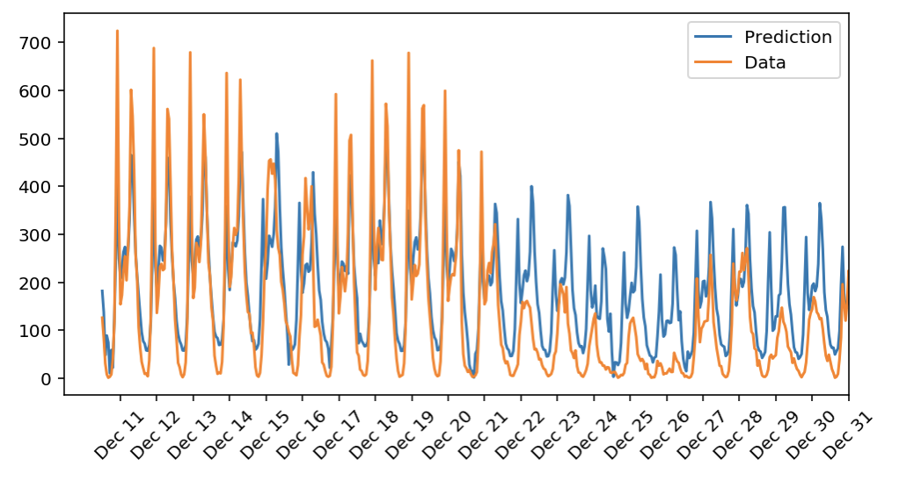
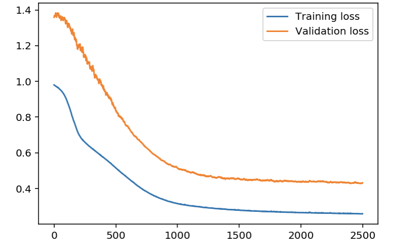

# Project Description
In this project, I built a simple neural network from scrath which only contains one hidden layer which is fully connected. This network was used  to predict daily bike rental ridership. 
One interting aspect about this network is that it was designed using pure numpy and a simple version of the backpropagation algorithm was coded from scratch.

# Dataset 

The core data set is related to  
the two-year historical log corresponding to years 2011 and 2012 from Capital Bikeshare system, Washington D.C., USA which is 
publicly available in http://capitalbikeshare.com/system-data. We aggregated the data on two hourly and daily basis and then 
extracted and added the corresponding weather and seasonal information. Weather information are extracted from http://www.freemeteo.com. 

# Execution

Just install numpy and execute the attached jupyter notebook :)
