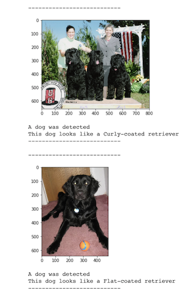

# Dog Application

The aim of this repository is to use data science and deep learning techniques to create an application capable of achiving the following:
1. Determine whether an input photo contains a human or a dog.
2. In case of finding a dog indicate what is its breed (according to a predefined set of 133 classes), In case of finding a human to indicate which dog breed is resembled.

# Implementation

This project proposes a complete deep learning pipeline to achive the tasks described above.
In first place, I defined and trained a CNN from scratch inspired by VGG16.
In second place, I applied transfer learning, using the pretrained VGG16 CNN as feature extractor.
Finally I compared the performance of both network on my testing set finding out that the one that used transfer learning was by far superior achieving 70% of accuracy on the testing set.

# Project Execution

To execute this project follow these steps:

1. Create a python 3 virtual environment and install the dependencies listed in the requirements.txt files, it is highly recommended to install pytorch so that it supports GPU (conda offers a great alternative.

2. Follow the steps described in the first section of the dogs app jupyter notebook.

