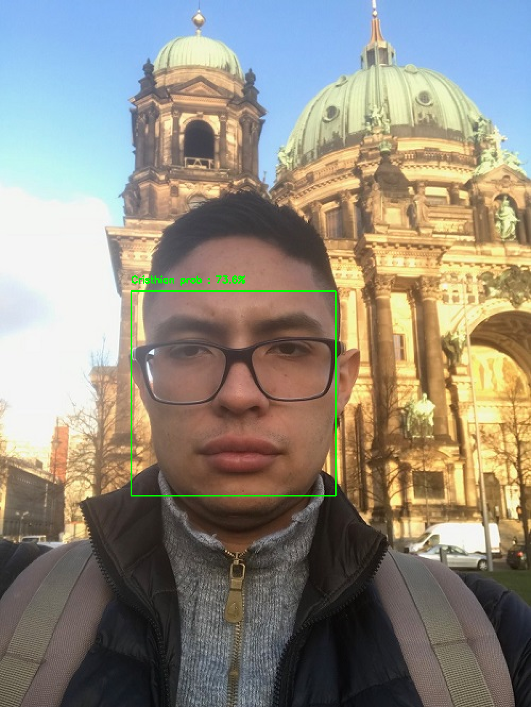

# Face Recognition System (2.1.face_recognition_training)
# Training Phase
## Description
This project employs the power of a pretrained CNN to generate face embeddings. These embeddings are then used to train a SVM model to recognize faces!
The embeddings and the model are stored in a folder called **model** which is used by the 2.2.face_recognition_recognition project

 

## Recommendations

Before trying the code please make sure that you follow the instructions listed below:

1. Install python 3.6.
2. Download and install Visual Studio (including C++). This is important so that the dlib installation does not crash.
3. Create a new python 3.6 virtual environment and install the dependencies listed in the requirement.txt file (i.e. pip install -r requirementx.txt).
 
## Instructions
Steps 1 and 2 should be executed **ONCE**, unless you want to train your system with a new set of images.

1. Create embeddings using a pretrained CNN from each of the classes inside the folder pointed by the --path parameter : **python get_embeddings.py --path *folder containing the images to be used during training***. The folder containing the images to be used during training should have the structure shown below. 
 
 
 
2. Train an SVM model with the embeddings generated on step 1 to recognize a set of faces : **python train_recognizer.py**

## Sources.

This repo was inspired by:

1. *https://www.pyimagesearch.com/2018/06/18/face-recognition-with-opencv-python-and-deep-learning/*
2. *https://krasserm.github.io/2018/02/07/deep-face-recognition/*
3. *https://www.coursera.org/specializations/deep-learning*

