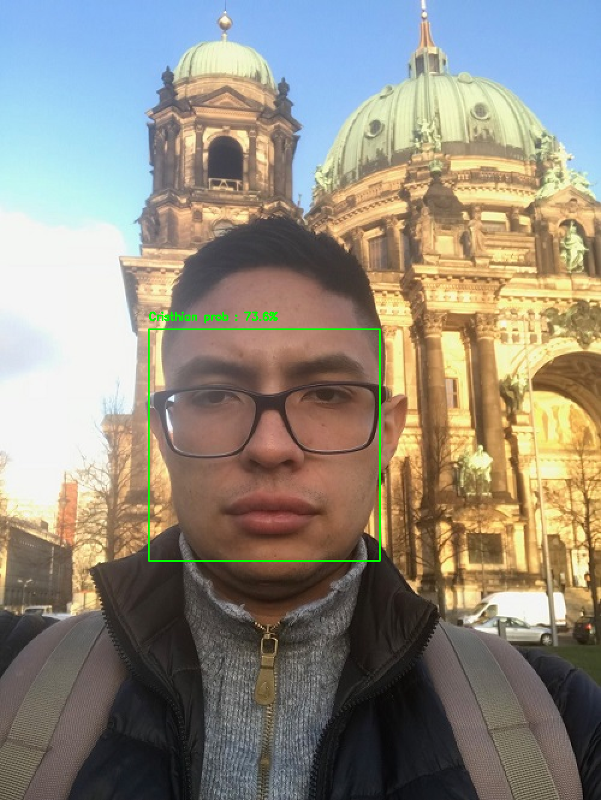

# Face Recognition System (2.2.face_recognition_recognition)

# 1. Recognition phase

## Description
This project employs the embeddings and the SVM model generated  when executing *2.1.face_recognition_training*

 

## Recommendations

Before trying the code please make sure that you follow the instructions listed below:

1. Install python 3.6.
2. Download and install Visual Studio (including C++). This is important so that the dlib installation does not crash.
3. Create a new python 3.6 virtual environment and install the dependencies listed in the requirement.txt file (i.e. pip install -r requirementx.txt).

## Instructions
Steps 1 and 2 should be executed **ONCE**, unless you want to train your system with a new set of images.

1. Copy and paste the **model folder** generated when executing the pipeline in 2.1.face_recognition_training. This folder contains the embeddings and the SVM model.

2. To start recognizing people you have two options. 

To recognize people in static images (i.e. photos captured with a smartphone)  try **python recognize_faces_image.py -o (option) -p (path)**. The <option> parameter can be either i or f. Type *i* if you want to recognize faces in a single image, type *f* if you want to recognize faces inside a folder containing several images. 
The <path> option is the pointing to the image(s) to be recognized. If you typed i as option, it is expected to be a path pointing to a single file, if you typed f it is expected to be a path pointing to a folder.
 
To test your system real time with your laptop camera try  **python recognize_face_in_video.py**

## Sources.

This repo was inspired by:

1. *https://www.pyimagesearch.com/2018/06/18/face-recognition-with-opencv-python-and-deep-learning/*
2. *https://krasserm.github.io/2018/02/07/deep-face-recognition/*
3. *https://www.coursera.org/specializations/deep-learning*
