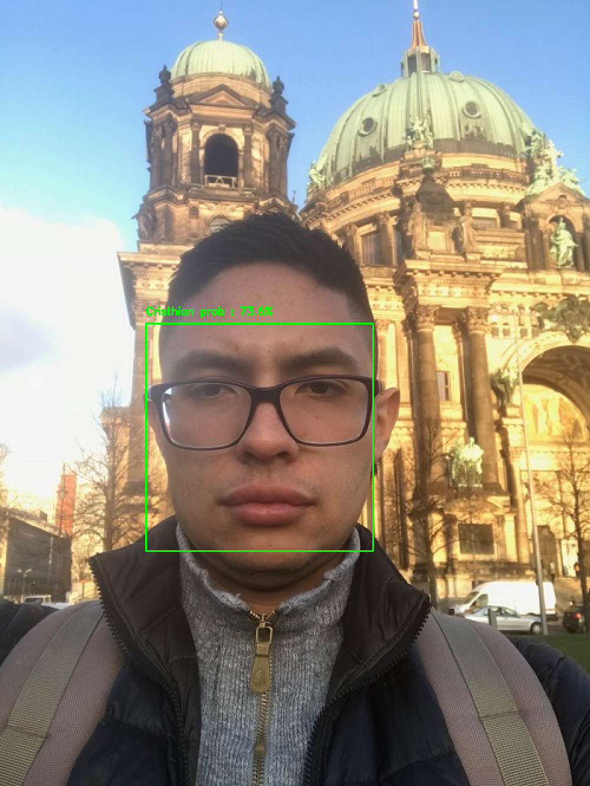

# Face Recognition System

## Description
This project employs the power of a pretrained CNN to generate face embeddings. These embeddings are then used to train a SVM model to recognize faces!

 

## Recommendations

Before trying the code please make sure that you follow the instructions listed below:

1. Install python 3.6.
2. Download and install Visual Studio (including the C++). This is important so that the dlib installation does not crash.
3. Create a new python 3.6 virtual environment and install the dependencies listed in the requirement.txt file (i.e. pip install -r requirementx.txt).
4. Create a folder that lives within the same path of this repo and name it images. This folder will store the images to be used during the training phase. Please follow the structure shown in the image below (one subfolder for each class, which in this case is a person to be recognized).
 
 
 
## Instructions
Steps 1 and 2 should be executed **ONCE**, unless you want to train your system with a new set of images.

1. Create embeddings using a pretrained CNN from each of the classes inside the images folder : **python get_embeddings.py**
2. Train an SVM model with the embeddings generated on step 1 to recognize a set of faces : **python train_recognizer.py**

To test your system on images try step 3

3. **python recognize_faces_image.py -o (option) -p (path)**. The <option> parameter can be either i or f. Type *i* if you want to recognize faces in a single image, type *f* if you want to recognize faces inside a folder containing several images. 
The <path> option is the pointing to the image(s) to be recognized. If you typed i as option, it is expected to be a path pointing to a single file, if you typed f it is expected to be a path pointing to a folder.

To test your system real time with your laptop camera try step 4

4. **python recognize_face_in_video.py**
